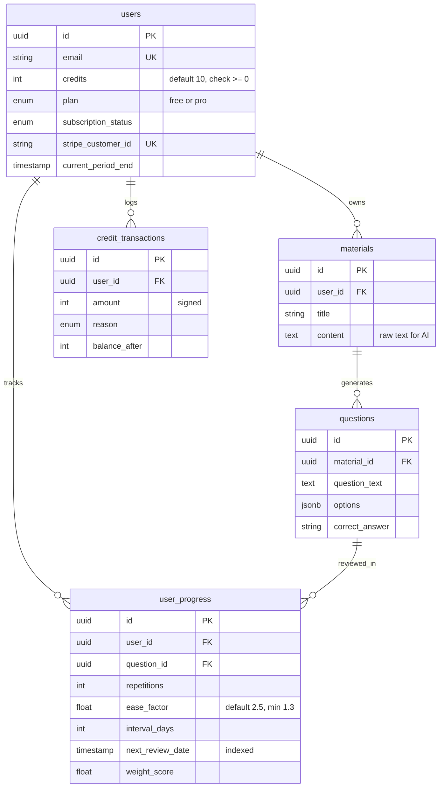
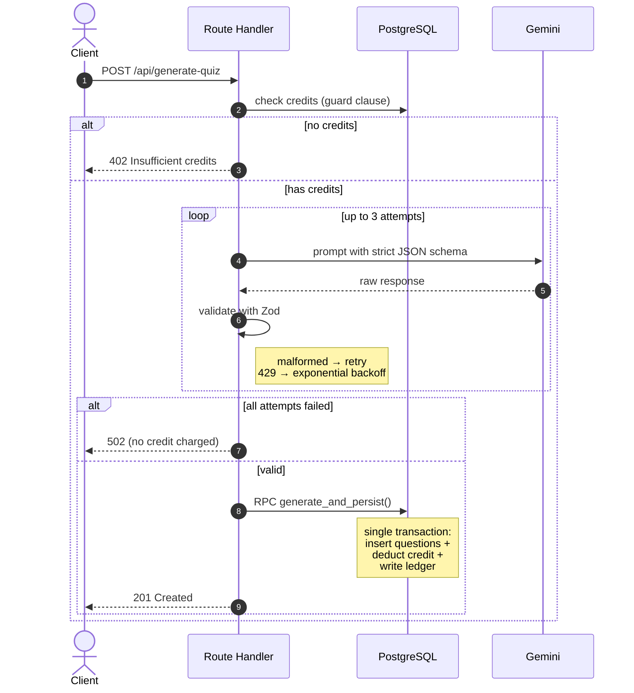

# Smart Study & Quiz Generator

An AI-powered spaced-repetition study platform. Paste your study material, let AI generate quizzes from it, and review with an SM-2 scheduling engine that prioritizes what you keep forgetting.

**[Live Demo →](https://smart-study-saas-jdc4-61kqwrbdv-adityaaryas182-1622s-projects.vercel.app)** · Built with Next.js 16, Supabase, and Google Gemini.

---

## Why this project

Most quiz apps stop at "generate questions." This one models the harder part: **deciding what to show you and when**. Two algorithms drive that, and both run inside PostgreSQL rather than the application layer:

- **SM-2 spaced repetition** — schedules each question's next review based on answer quality, ease factor, and repetition count.
- **Weighted random selection** — among due questions, ones you answer incorrectly surface more often, using Efraimidis-Spirakis sampling (`ORDER BY -ln(random()) / weight_score`).

---

## Features

- Email/password and Google OAuth authentication
- Material management (create, list, delete) with row-level isolation
- AI quiz generation with strict schema validation and automatic retry
- Interactive study sessions with immediate feedback
- Analytics dashboard: mastery progress and 7-day review forecast
- Credit-based usage metering with a full audit ledger

---

## Tech stack

| Layer | Choice | Why |
|---|---|---|
| Framework | Next.js 16 (App Router) | Server Components + Route Handlers in one deployable unit |
| Database | Supabase (PostgreSQL) | Row Level Security, plpgsql functions, managed auth |
| AI | Google Gemini (`@google/genai`) | Generous free tier, native JSON output mode |
| Validation | Zod | Runtime schema enforcement on AI responses |
| Charts | Recharts | Composable, minimal footprint |
| Hosting | Vercel | Zero-config Next.js deploys |

Entire stack runs on free tiers — no infrastructure cost.

---

## Architecture

### Data model

Five tables. `user_progress` is the junction table carrying SM-2 state, with a composite unique constraint on `(user_id, question_id)` so a user holds exactly one scheduling state per question.



### Quiz generation flow

The critical path. Credits are deducted **last**, inside the same transaction that persists the questions — a failed AI call never costs the user anything.



---

## Design decisions

**Business logic lives in PostgreSQL functions, not JavaScript.**
Every multi-step write goes through a plpgsql function called via `.rpc()`. A plpgsql function body is a single transaction, so partial writes are impossible — questions can't be saved without the credit deduction and ledger entry landing too. Doing this from JavaScript would mean three separate calls with no atomicity guarantee.

**Credits are deducted after the AI succeeds, never before.**
The credit check up front is a fast-fail guard. The actual decrement happens inside the persistence transaction, with the user row locked (`FOR UPDATE`) to prevent races between concurrent requests.

**Ease factor survives lapses.**
When a user answers incorrectly, SM-2 resets `repetitions` and `interval_days` — but the recalculated `ease_factor` is kept, not reset to 2.5. Ease factor represents a question's intrinsic difficulty, which accumulates across the question's lifetime. Resetting it is a subtle bug that makes scheduling less accurate over time. A floor of 1.3 prevents runaway difficulty.

**Correct answers never reach the client during a session.**
`get_study_session` deliberately omits `correct_answer` from its payload. Grading happens server-side on submission, and the key is only returned *after* the user answers.

**Defense in depth on data access.**
RLS policies scope every table to `auth.uid()`. Privileged operations use a service-role client that bypasses RLS, so those functions re-verify ownership explicitly and are revoked from `anon`/`authenticated` roles.

---

## Local setup

```bash
git clone https://github.com/[username]/smart-study-saas.git
cd smart-study-saas
npm install
```

Create `.env.local`:

```bash
NEXT_PUBLIC_SUPABASE_URL=
NEXT_PUBLIC_SUPABASE_PUBLISHABLE_KEY=
SUPABASE_SECRET_KEY=
GEMINI_API_KEY=
```

Run the migrations in `supabase/migrations/` in order (`0001` → `0005`) via the Supabase SQL Editor, then:

```bash
npm run dev
```

---

## API

| Endpoint | Method | Description |
|---|---|---|
| `/api/generate-quiz` | POST | Generate and persist questions from a material |
| `/api/quiz/study-session` | GET | Fetch due questions with weighted selection |
| `/api/quiz/submit-answer` | POST | Grade answer, update SM-2 state |
| `/api/analytics/dashboard` | GET | Aggregate learning statistics |

---

## Roadmap

- [ ] Stripe subscription tier with monthly credit refills
- [ ] PDF/DOCX upload as material source
- [ ] Finer-grained answer rating (Hard / Good / Easy → quality 3/4/5)

---

## License

MIT