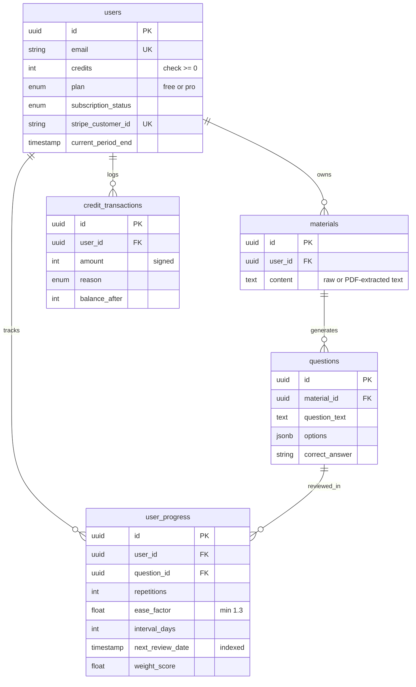
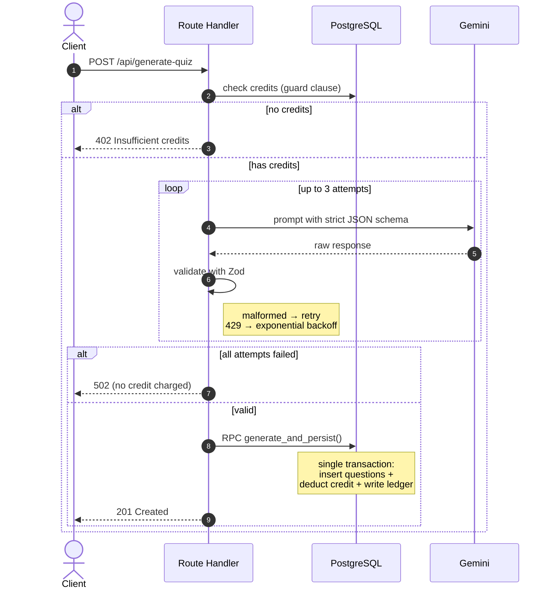

# Smart Study & Quiz Generator

An AI-powered spaced-repetition study platform. Paste text or **upload a PDF**, let AI generate quizzes from it, and review with an SM-2 scheduling engine that prioritizes what you keep forgetting.

**[Live Demo →](https://smart-study-saas-jdc4.vercel.app)** · Next.js 16 · Supabase · Google Gemini · Stripe

---

## Why this project

Most quiz apps stop at "generate questions." This one models the harder part: **deciding what to show you and when**. Two algorithms drive that, and both run inside PostgreSQL rather than the application layer:

- **SM-2 spaced repetition** — schedules each question's next review based on answer quality, ease factor, and repetition count. Users grade recalled answers *Hard / Medium / Easy* (quality 3/4/5), so intervals adapt to how well they actually know each item.
- **Weighted random selection** — among due questions, ones answered incorrectly resurface more often, using Efraimidis-Spirakis sampling (`ORDER BY -ln(random()) / weight_score`).

It's also a complete SaaS slice: authentication, PDF ingestion, usage metering, a subscription tier with real enforcement, and a webhook-driven billing sync — all on free-tier infrastructure.

---

## Features

- Email/password and Google OAuth authentication
- **PDF upload** with server-side text extraction (rejects scanned/image-only PDFs)
- Paste-text material entry, with per-tier quota enforcement (Free: 3, Pro: 50)
- AI quiz generation with strict schema validation and automatic retry
- Interactive study sessions with server-side grading and granular difficulty rating
- Analytics dashboard: mastery progress and 7-day review forecast
- Credit-based usage metering with a full audit ledger
- Stripe subscriptions with idempotent webhook handling and a customer portal
- Duplicate-generation guard and graceful loading / error / not-found states

---

## Tech stack

| Layer | Choice | Why |
|---|---|---|
| Framework | Next.js 16 (App Router) | Server Components + Route Handlers in one deployable unit |
| Language | TypeScript | Type safety across the full stack |
| Database | Supabase (PostgreSQL) | Row Level Security, plpgsql functions, managed auth |
| AI | Google Gemini (`@google/genai`) | Generous free tier, native JSON output mode |
| PDF parsing | `unpdf` | Serverless-safe PDF.js build; zero native deps (survives Vercel) |
| Validation | Zod | Runtime schema enforcement on AI responses |
| Billing | Stripe (Checkout + Webhooks) | Hosted PCI-compliant checkout, subscription lifecycle |
| Charts | Recharts | Composable, minimal footprint |
| Styling | Tailwind CSS | Utility-first, consistent design system |
| Hosting | Vercel | Zero-config Next.js deploys |

Runs entirely on free tiers — no infrastructure cost.

---

## Architecture

### Data model

Six tables. `user_progress` is the junction carrying SM-2 state, with a composite unique constraint on `(user_id, question_id)` so a user holds exactly one scheduling state per question. `stripe_events` enforces webhook idempotency via its primary key.



### Quiz generation flow

The critical path. Credits are deducted **last**, inside the same transaction that persists the questions — a failed AI call never costs the user anything.



---

## Design decisions

**Business logic lives in PostgreSQL functions, not JavaScript.**
Every multi-step write goes through a plpgsql function called via `.rpc()`. A function body is a single transaction, so partial writes are impossible — questions can't be saved without the credit deduction and ledger entry landing too.

**Credits are deducted after the AI succeeds, never before.**
The upfront credit check is a fast-fail guard. The actual decrement happens inside the persistence transaction, with the user row locked (`FOR UPDATE`) to prevent races between concurrent requests.

**Webhooks are idempotent by construction.**
Stripe retries webhooks on timeout, so the same event can arrive multiple times. Each event ID is inserted into a `stripe_events` table with a primary-key constraint inside the same transaction that grants credits. A duplicate insert throws a unique violation, the function returns early, and credits are granted exactly once.

**Subscription state is derived, never trusted from one column.**
A single `isProUser()` helper requires both `plan === 'pro'` and `subscription_status === 'active'`. A past-due user is treated as Free everywhere — billing UI, material quota, and server actions all flow from the same definition, so they can't drift out of sync.

**PDF extraction fails loudly, not silently.**
Scanned/image-only PDFs yield little to no text. Rather than saving an empty material and generating garbage questions, the upload endpoint detects sub-threshold text length and returns a clear error telling the user to use a text-based PDF. File size and MIME type are validated before parsing.

**Serverless-safe PDF parsing.**
`unpdf` was chosen over the more popular `pdf-parse` specifically because it ships a serverless build of PDF.js with zero native dependencies — `pdf-parse`'s native canvas dependency crashes on Vercel. Registered in `serverExternalPackages` so Next.js doesn't mis-bundle it.

**Ease factor survives lapses.**
On a wrong answer, SM-2 resets `repetitions` and `interval_days` but keeps the recalculated `ease_factor` — a question's intrinsic difficulty accumulates across its lifetime. A floor of 1.3 prevents runaway difficulty.

**Correct answers never reach the client during a session.**
`get_study_session` omits `correct_answer` from its payload. Grading happens server-side on submission; the key is only returned after the user answers.

**Quotas and grading are enforced server-side.**
Tier limits and answer correctness are decided in the API, not hidden in the UI — calling endpoints directly can't bypass them. The UI mirrors these for a good experience.

---

## Local setup

```bash
git clone https://github.com/adityaaryas182/smart-study-saas.git
cd smart-study-saas
npm install
```

Create `.env.local`:

```bash
NEXT_PUBLIC_SUPABASE_URL=
NEXT_PUBLIC_SUPABASE_PUBLISHABLE_KEY=
SUPABASE_SECRET_KEY=
GEMINI_API_KEY=
STRIPE_SECRET_KEY=
STRIPE_PRICE_ID=
STRIPE_WEBHOOK_SECRET=
NEXT_PUBLIC_SITE_URL=http://localhost:3000
```

Run the migrations in `supabase/migrations/` in order (`0001` → `0006`) via the Supabase SQL Editor. For local Stripe webhooks:

```bash
stripe listen --forward-to localhost:3000/api/webhooks/stripe
npm run dev
```

---

## API

| Endpoint | Method | Description |
|---|---|---|
| `/api/materials/upload-pdf` | POST | Extract text from an uploaded PDF and save as material |
| `/api/generate-quiz` | POST | Generate and persist questions from a material |
| `/api/quiz/study-session` | GET | Fetch due questions with weighted selection |
| `/api/quiz/submit-answer` | POST | Grade answer server-side, update SM-2 state |
| `/api/analytics/dashboard` | GET | Aggregate learning statistics |
| `/api/webhooks/stripe` | POST | Idempotent subscription lifecycle sync |

---

## Roadmap

- [x] Stripe subscription tier with monthly credit refills
- [x] Per-tier quota enforcement
- [x] Granular answer rating (Hard / Medium / Easy → quality 3/4/5)
- [x] PDF upload as material source
- [ ] DOCX upload support
- [ ] OCR fallback for scanned PDFs

---

## License

MIT